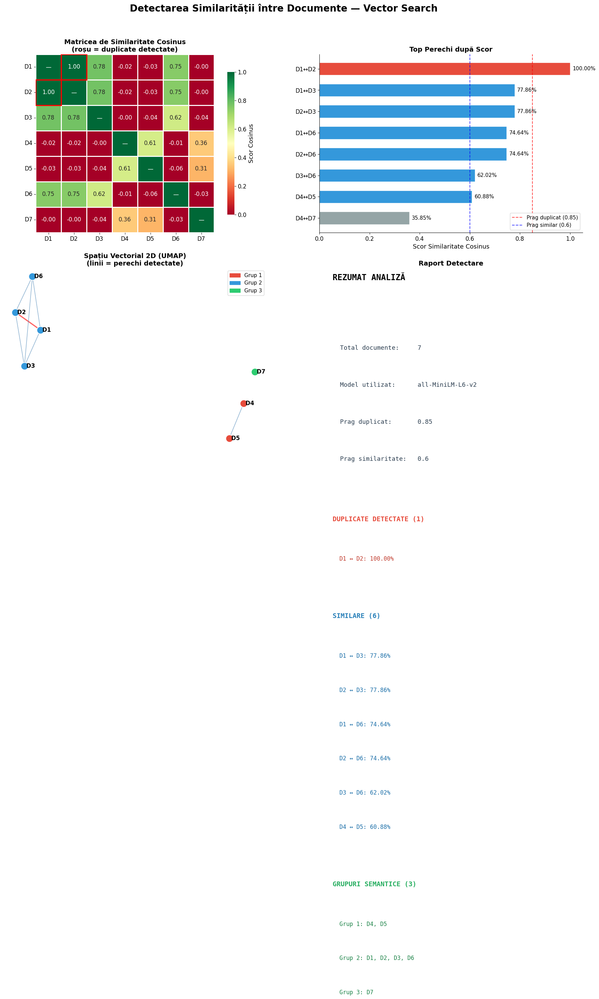
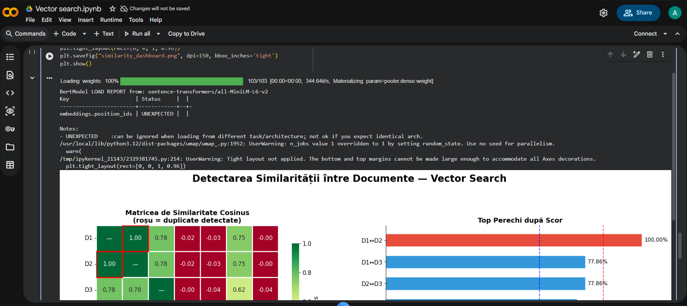

# Detectarea Similarității între Documente folosind Vector Search

Proiectul demonstrează identificarea documentelor **duplicate** și **similare semantic** folosind tehnici de **AI Vector Search**.

Soluția transformă documentele text în **vectori (embeddings)** și compară aceste reprezentări numerice pentru a determina cât de apropiate sunt ca sens, nu doar ca text.

---

## Obiectiv

- Detectarea documentelor duplicate (identice sau aproape identice)
- Identificarea documentelor similare semantic (parafrazare, idei similare)
- Gruparea documentelor în **clustere tematice**
- Vizualizarea rezultatelor într-un dashboard intuitiv

---

## Conceptul de bază

Text → Embedding (vector) → Similaritate → Detectare perechi → Clustering → Vizualizare

- **Embedding** = reprezentare numerică a sensului unui text
- **Cosine similarity** = măsură a asemănării între două texte
- **Clustering** = gruparea documentelor similare

---

## Rezultat

Dashboard-ul generat conține:

- matricea de similaritate
- top perechi de documente
- reprezentare 2D a spațiului vectorial
- raport final cu rezultate

---

## Dataset

Proiectul utilizează un set mic de documente text (7 exemple), care includ:

- duplicate exacte
- parafraze (aceeași idee exprimată diferit)
- documente complet diferite (teme distincte)

Exemple:

- resetare parolă / login
- piață financiară

---

## Tehnologii utilizate

- Python
- sentence-transformers (embeddings)
- NumPy
- scikit-learn (clustering)
- Matplotlib & Seaborn (vizualizare)
- UMAP / PCA (reducere dimensională)

---

## Cum funcționează

### 1. Generare embeddings

Fiecare document este transformat într-un vector numeric folosind modelul:

`all-MiniLM-L6-v2`

---

### 2. Calcul similaritate

Se calculează **cosine similarity** între toate perechile de documente.

Rezultatul este o matrice:

- valori între -1 și 1
- valori apropiate de 1 = documente similare
- valori apropiate de 0 = documente diferite

---

### 3. Detectare duplicate și similare

Se folosesc două praguri:

- **≥ 0.85** → duplicate
- **≥ 0.60** → similare semantic

Astfel:

- documentele identice sunt detectate ca duplicate
- documentele cu sens apropiat sunt detectate ca similare

---

### 4. Clustering semantic

Se aplică **Agglomerative Clustering** pentru a grupa documentele în funcție de similaritate.

Rezultatul:

- documentele apropiate semantic sunt grupate automat
- nu este necesară etichetare manuală

---

### 5. Vizualizare rezultate

Dashboard-ul conține:

- **Heatmap** – matrice de similaritate
- **Bar chart** – top perechi după scor
- **Spațiu 2D** – poziționarea documentelor în funcție de sens
- **Raport text** – rezumat final al analizei

---

## Rezultate

### Duplicate detectate

- **D1 ↔ D2 (100%)**

---

### Documente similare

- D1 ↔ D3: 77.86%
- D2 ↔ D3: 77.86%
- D1 ↔ D6: 74.64%
- D2 ↔ D6: 74.64%
- D3 ↔ D6: 62.02%
- D4 ↔ D5: 60.88%

---

### Grupuri semantice

- **Grup 1:** D4, D5 (tematică financiară)
- **Grup 2:** D1, D2, D3, D6 (login / parolă)
- **Grup 3:** D7 (document izolat)

---

## Interpretare

- Sistemul detectează corect duplicatele exacte
- Recunoaște parafraze (texte diferite, același sens)
- Grupează automat documentele pe teme
- Evidențiază relațiile semantice dintre documente

